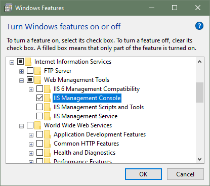
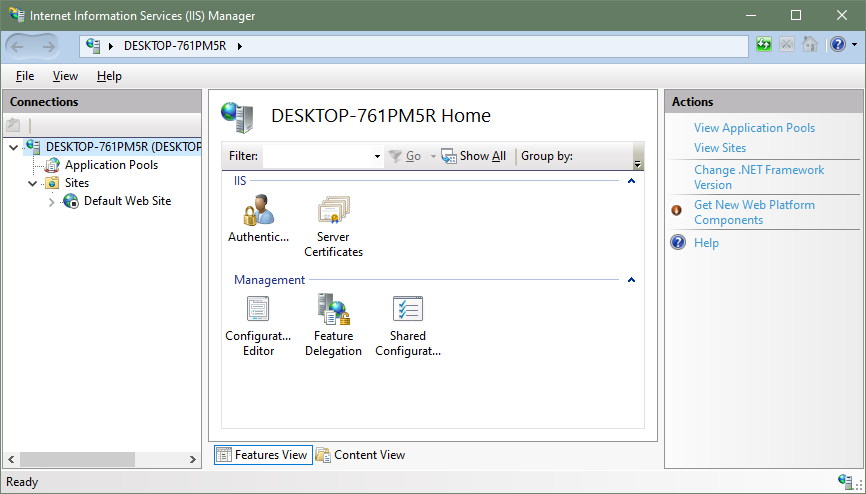

<figure style="float:right; margin-left:3em; width:50%;display:none;">
    <a href="http://SomeGif">
        
    </a>
    <figcaption>Needs a gif</figcaption>
</figure>

Looking at Umbraco, I need to find my old IIS install scripts...  
Let's use the [Adam the automator `IISAdministration` tut](https://adamtheautomator.com/powershell-script-to-create-iis-website/)!

----------------------------------------

## TOC ##

+ [Installing IIS Manager on Windows 10](#Installing-IIS-Manager-on-Windows-10)
+ [Installing IISAdministration](#Installing-IISAdministration)
+ [Credits](#Credits)

----------------------------------------

## Installing IIS Manager on Windows 10  ##

Don't be a silly - remember to turn IIS on in the `Turn Windows features on or off`, like I totally forgot to do when starting this tutorial  
This wonn't be needed in docker if you are being clever...  


Here is IIS Manager (or `inetmgr`) running


It may need a restart to avoid the dreaded `Could not load file or assembly 'Microsoft.Web.Administration'...` error  
or [upgrading powershell to 7.0](https://www.thomasmaurer.ch/2019/07/how-to-install-and-update-powershell-7/)

```powershell
iex "& { $(irm https://aka.ms/install-powershell.ps1) } -UseMSI"
Get-Host | Select-Object Version
```

----------------------------------------

## Installing IISAdministration  ##

Obviously you need powershell running as admin

```powershell
Install-Module -Name IISAdministration
Import-Module IISAdministration
Get-Command -Module IISAdministration
```

----------------------------------------

## Making an AppPool ##

+ <https://docs.microsoft.com/en-us/iis/get-started/whats-new-in-iis-10/iisadministration-powershell-cmdlets>

----------------------------------------

## Making a website  ##

## SSL Self Signed Cert and binding ##

+ [MS - new-iissitebinding](https://docs.microsoft.com/en-us/powershell/module/iisadministration/new-iissitebinding?view=win10-ps)
+ [My Powershell Secrets article](http://www.finnangelo.com/powershell/2020/02/02/Powershell_Secrets.html)

```powershell

# Check PoSh PKI (Public Key Infrastructure) module is installed
Get-Command -Module PKI

```

## THIS NEEDS ORGANISATION AND PESTER TESTS ##

```powershell
# Set-ExecutionPolicy Restricted
Set-ExecutionPolicy Unrestricted
#---------------------------------------
function New-MyIISAppPool ([string] $AppName) {    
    Write-Debug("New-MyIISAppPool : $AppName")
    Import-Module WebAdministration
    if(Test-Path -Path "IIS:\AppPools\$AppName")
    {
        Remove-WebAppPool -Name $AppName
    }
    New-Item -Path "IIS:\AppPools" -Name "$AppName" -Type AppPool
    Set-ItemProperty -Path "IIS:\AppPools\$AppName" -name "managedRuntimeVersion" -value "v4.0"
    Set-ItemProperty -Path "IIS:\AppPools\$AppName" -name "enable32BitAppOnWin64" -value $false
    Set-ItemProperty -Path "IIS:\AppPools\$AppName" -name "autoStart" -value $true
    Set-ItemProperty -Path "IIS:\AppPools\$AppName" -name "processModel" -value @{identitytype="ApplicationPoolIdentity"}
    Set-ItemProperty -Path "IIS:\AppPools\$AppName" -name "managedPipelineMode" -value 0 # This is Classic (vs Integrated=0) Mode  
}

#---------------------------------------
function New-MyIISFolders ([string] $RootPath, [string] $AppName) {
    Write-Debug("New-MyIISFolders : $RootPath $AppName")

    # Setup Website Physical Path
    if (Test-Path -Path "$RootPath\$AppName") {
        Remove-Item -Path "$RootPath\$AppName" -Recurse -Force
    }
    New-Item -ItemType directory -Path "$RootPath\$AppName"
}
# Applies NTAccount permissions to user of WebAppPool i.e. ApplicationPoolIdentity i.e. `IIS AppPool\$AppName` i.e. `IIS AppPool\TRASHME`
# This is overpermissioned for a website, and needs refinement
function New-MyIISDirectoryPermissions ([string] $RootPath, [string] $AppName) {    
    Write-Debug("New-MyIISDirectoryPermissions : $AppName")
    Import-Module WebAdministration
    $appPoolSid = (Get-ItemProperty "IIS:\AppPools\$AppName").applicationPoolSid
    $identifier = New-Object System.Security.Principal.SecurityIdentifier $appPoolSid
    $user = $identifier.Translate([System.Security.Principal.NTAccount])
    $Acl = Get-Acl "$RootPath\$AppName"
    $Ar = New-Object  system.security.accesscontrol.filesystemaccessrule($user,"FullControl", "ContainerInherit,ObjectInherit", "None", "Allow")
    $Acl.SetAccessRule($Ar)
    Set-Acl "$RootPath\$AppName" $Acl
}
#---------------------------------------
function Remove-MyCert ( [string] $StoreLocation, [string] $HostHeader ) {
	$oldCert = Get-ChildItem $StoreLocation | Where-Object Subject -eq  "CN=$HostHeader"
	if($oldCert) {
		$oldCert | Remove-Item 
	}
}

function New-MyCert ( [string] $StoreLocation, [string] $HostHeader ) {
	$oldCert = Get-ChildItem $StoreLocation | Where-Object Subject -eq  "CN=$HostHeader"
	if($oldCert) {
		$oldCert | Remove-Item 
	}
	$certificate = New-SelfSignedCertificate -DnsName $HostHeader -CertStoreLocation $StoreLocation
}
#---------------------------------------
function Remove-MyIISWebSite ( [string] $RootPath, [string] $AppName, [int] $Port, [int] $SslPort, [string] $StoreLocation, [string] $HostHeader ) {
    $portBinding = Get-WebBinding | Where-Object bindingInformation -EQ "*:${Port}:"
    if($portBinding) {
        Remove-WebBinding -InputObject $portBinding
    }
    $sslPortBinding = Get-WebBinding | Where-Object bindingInformation -EQ "*:${SslPort}:$HostHeader"
    if($sslPortBinding) {
        Remove-WebBinding -InputObject $sslPortBinding 
    }
    $website = Get-WebSite -Name "$AppName"
    if($website) {
        Remove-Item $webSite.name
    }
}
function New-MyIISWebSite ( [string] $RootPath, [string] $AppName, [int] $Port, [int] $SslPort, [string] $StoreLocation, [string] $HostHeader ) {

    Write-Debug("New-MyIISWebSite : $AppName")  
    Import-Module WebAdministration

    Get-WebBinding -Name $AppName -Port $SslPort  -HostHeader "$HostHeader" | Remove-Item
    Get-WebSite -Name $AppName | Remove-Item

    New-WebSite -Name "$AppName" -Port $Port -PhysicalPath "$RootPath\$AppName" -ApplicationPool "$AppName" -Force
    Restart-WebAppPool "$AppName"
    Stop-Website -Name "$AppName"
    Start-Website -Name "$AppName"

    # Only add SSL if the cert exists
    $myCert = Get-ChildItem $StoreLocation | Where-Object Subject -eq  "CN=$HostHeader"
    if ($myCert) {        
        New-WebBinding -Name "$AppName" -Protocol https -Port $SslPort -HostHeader $HostHeader -SslFlags 1
        $binding=Get-WebBinding -Name "$AppName" -Port $SslPort  -HostHeader $HostHeader
        $binding.AddSslCertificate($myCert.GetCertHashString(), "My")
    }
}
#---------------------------------------
function Restart-MyIISWebSite ([string] $AppName) {
    Write-Debug("Restart-MyIISWebSite : $AppName")
    Restart-WebAppPool $AppName
    Stop-Website -Name $AppName
    Start-Website -Name $AppName
}
#---------------------------------------
#https://blog.ukotic.net/2017/08/15/could-not-establish-trust-relationship-for-the-ssltls-invoke-webrequest/
function Ignore-ServerCertificateValidation() {
    if (-not ([System.Management.Automation.PSTypeName]'ServerCertificateValidationCallback').Type)
    {
    $certCallback = @"
    using System;
    using System.Net;
    using System.Net.Security;
    using System.Security.Cryptography.X509Certificates;
    public class ServerCertificateValidationCallback
    {
        public static void Ignore()
        {
            if(ServicePointManager.ServerCertificateValidationCallback ==null)
            {
                ServicePointManager.ServerCertificateValidationCallback += 
                    delegate
                    (
                        Object obj, 
                        X509Certificate certificate, 
                        X509Chain chain, 
                        SslPolicyErrors errors
                    )
                    {
                        return true;
                    };
            }
        }
    }
"@
        Add-Type $certCallback
    }
    [ServerCertificateValidationCallback]::Ignore()
}
#---------------------------------------
#$VerbosePreference = "Continue"
$DebugPreference = "Continue"


$AppName = "TrashMe"
$RootPath = "D:\MyIIS"
$Port = 40080 #57362
$SslPort = 40443 #57362
$StoreLocation = "Cert:\LocalMachine\My"
$HostHeader = "$AppName.finnangelo.com"

Remove-MyIISWebSite $AppName
Remove-MyCert $StoreLocation $HostHeader
Remove-MyIISAppPool $AppName

New-MyIISAppPool $AppName
New-MyIISFolders $RootPath $AppName
New-MyIISDirectoryPermissions $RootPath $AppName
New-MyCert $StoreLocation $HostHeader
New-MyIISWebSite $RootPath $AppName $Port $SslPort $StoreLocation $HostHeader

Set-Content -Path '$RootPath\$AppName\index.html' -Value 'test string'

Restart-MyIISWebSite $AppName

Ignore-ServerCertificateValidation
$result = Invoke-WebRequest -Uri "https://${HostHeader}:${SslPort}/index.html" #-Headers @{"apiKey" = "123456"}

$result.Content

$VerbosePreference = "SilentlyContinue"
$DebugPreference = "SilentlyContinue"
#---------------------------------------
```

----------------------------------------


## Credits ##

+ [Interworks - How to encrypt and store credentials securely](https://interworks.com/blog/trhymer/2013/07/08/powershell-how-encrypt-and-store-credentials-securely-use-automation-scripts/)
+ [Kloud - Using saved credentials in powershell](https://blog.kloud.com.au/2016/04/21/using-saved-credentials-securely-in-powershell-scripts/)
+ [Stackoverflow - Convert a secureString](https://stackoverflow.com/questions/28352141/convert-a-secure-string-to-plain-text)

If you find this useful, go be nice to someone. Pay it forward.

_Cheers!_
